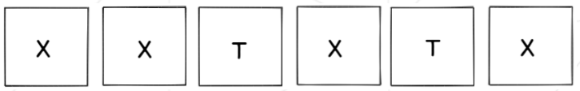

[Português](https://github.com/42sp/dontpanic_baby_JAB/blob/main/README.md) | [English](https://github.com/42sp/dontpanic_baby_JAB/blob/main/README_en.md)

<h2 align="center"> DON'T PANIC, BABY!!</h2>

### How to play
 

> _The game consists of guessing the hidden equation that results in “42”. Every guess must be equal to this target number (42) and after each guess, tip characters will show how close you are._

 

- The hidden equation is always the same.

- All equations must result in the target number (42), otherwise the equation will be
rejected and no answer tip should be provided.

- The accepted inputs are numbers (0-9) and *, /, +, -.

 

The tips are:

- The “T” means the character exists in the hidden equation, but is not in the correct
spot.

- The “X” means the character is not in the hidden equation.

- The “C” means the character exists in the hidden equation, and it is in the right
position.

Let’s take a look at an example:

---
